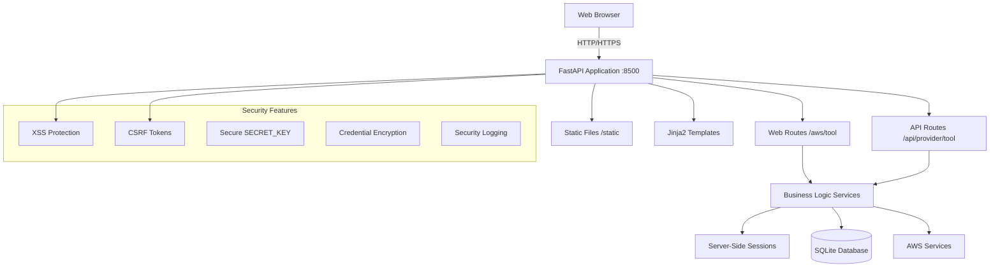

# PCM-Ops Tools

## Overview

PCM-Ops Tools is a unified multi-cloud operations platform built with FastAPI, designed to standardize operations across AWS, Azure, GCP, and ServiceNow. The application serves both API endpoints and web interface from a single FastAPI process on port 8500.

## Current Status

- **Unified FastAPI Application**: ✅ Single process serving REST APIs and web UI
- **AWS Tools**: ✅ Linux QC Patching (Prep/Post), SFT Fixer, Script Runner (backend service)
- **Security Features**: ✅ Phase 1 security fixes with feature flag controls
- **Session Management**: ✅ Server-side session storage with encryption support
- **Credential Management**: ✅ Secure AWS credential validation and caching
- **Web Interface**: ✅ Bootstrap 5 UI with HTMX for dynamic updates
- **Additional Providers**: 📝 Planned (Azure, GCP, ServiceNow integrations)

## Architecture

The platform uses a unified FastAPI application with modular provider-based architecture:



### Key Design Principles

1. **Unified Architecture**: Single FastAPI process serves both API and web interface
2. **Provider Discovery**: Dynamic registration of provider routers from `/backend/providers/`
3. **Security by Design**: Feature-flagged security controls (XSS, CSRF, encryption)
4. **Session Management**: Server-side session storage with optional encryption
5. **Tool Modularity**: Self-contained provider tools with api/, services/, schemas/ structure
6. **Backward Compatibility**: URL redirects maintain existing integrations

## Project Structure

```bash
PCM-Ops_Tools/                 (repository root)
├── backend/                    (FastAPI application - main entry point)
│   ├── main.py                 (FastAPI app with provider discovery)
│   ├── core/                   (configuration, security, logging)
│   │   ├── config.py           (Settings with feature flags)
│   │   ├── security.py         (XSS, CSRF, encryption)
│   │   ├── feature_flags.py    (Feature flag management)
│   │   └── utils/              (encryption, session store)
│   ├── providers/              (modular tools by provider)
│   │   └── aws/
│   │       ├── common/         (shared AWS utilities)
│   │       └── script_runner/  (AWS Script Runner backend service)
│   ├── web/                    (web UI routes)
│   │   ├── home.py             (main dashboard)
│   │   └── aws/                (AWS tool web interfaces)
│   ├── api/                    (core API endpoints)
│   ├── db/                     (SQLAlchemy models and database)
│   ├── templates/              (Jinja2 templates for web UI)
│   └── static/                 (CSS, JS, images)
├── frontend/                   (new frontend development)
├── data/                       (SQLite database and runtime data)
├── logs/                       (application and security logs)
├── archive/                    (deprecated Flask frontend)
└── docs/                       (project documentation)
```

## Quick Start

### Prerequisites

- Python 3.11+
- Poetry (for dependency management)

### Installation

```bash
# Clone the repository
git clone <repository-url>
cd PCM-Ops_Tools

# Initial setup (installs Poetry if needed)
./setup.sh

# Start the application
./start.sh
```

The application will be available at: http://localhost:8500

### Development Mode

```bash
# Start with development database and AWS mocking
./start.sh --dev

# Start with debug logging
./start.sh --debug
```

## Features

### Current Implementation

#### **Security Features** ✅
- **XSS Protection**: Input validation, security headers, content security policy
- **CSRF Protection**: Token-based protection for state-changing operations
- **Secure SECRET_KEY**: Auto-generated cryptographically secure keys
- **Credential Encryption**: Encrypted session storage for sensitive data
- **Security Logging**: Dedicated security event logging with structured format
- **Feature Flags**: Safe rollout/rollback controls for all security features

#### **AWS Tools** ✅
- **Linux QC Patching Prep**: Pre-patching validation and preparation
- **Linux QC Patching Post**: Post-patching validation and reporting  
- **SFT Fixer**: ServiceNow field validation and correction
- **Script Runner**: Multi-account script execution via SSM (backend service)
- **Async Operations**: Non-blocking AWS API calls using `aiobotocore` for high performance

#### **Core Platform** ✅
- **Unified FastAPI Application**: Single process serving APIs and web UI
- **Dynamic Provider Discovery**: Automatic registration of provider tools
- **Session Management**: Server-side sessions with 30-minute timeout
- **Credential Management**: Secure AWS credential validation for COM/GOV clouds
- **Database**: SQLite with SQLAlchemy 2.0 models
- **Web Interface**: Bootstrap 5 UI with HTMX for dynamic updates

### Planned Features 📝

- **Azure Integration**: Azure resource management tools
- **GCP Integration**: Google Cloud Platform operations
- **ServiceNow Integration**: Enhanced ServiceNow automation
- **Multi-Cloud Dashboards**: Unified view across cloud providers
- **Advanced Reporting**: Cross-cloud resource and cost reporting

## Configuration

### Environment Variables

Copy `.env.example` to `.env` and configure:

```bash
# Core settings
SECRET_KEY=your-secure-secret-key
DATABASE_URL=sqlite:///./data/pcm_ops_tools.db
DEV_MODE=false

# AWS Credentials (optional - can use IAM roles)
AWS_ACCESS_KEY_ID_COM=your-commercial-access-key
AWS_SECRET_ACCESS_KEY_COM=your-commercial-secret-key
AWS_ACCESS_KEY_ID_GOV=your-govcloud-access-key
AWS_SECRET_ACCESS_KEY_GOV=your-govcloud-secret-key

# Security Feature Flags (Phase 1)
FEATURE_FLAG_NEW_SECRET_KEY_HANDLING=enabled
FEATURE_FLAG_XSS_PROTECTION_ENABLED=enabled
FEATURE_FLAG_CSRF_TOKENS_ENABLED=enabled
FEATURE_FLAG_SECURE_CREDENTIAL_STORAGE=enabled
FEATURE_FLAG_STRUCTURED_LOGGING=enabled
```

### Access Points

- **Web Interface**: http://localhost:8500
- **API Documentation**: http://localhost:8500/docs
- **Health Check**: http://localhost:8500/api/health

### AWS Tools Access

- **Linux QC Patching Prep**: http://localhost:8500/aws/linux-qc-patching-prep
- **Linux QC Patching Post**: http://localhost:8500/aws/linux-qc-patching-post
- **SFT Fixer**: http://localhost:8500/aws/sft-fixer

## Development

### Code Quality

```bash
# Format code
poetry run black backend/

# Sort imports
poetry run isort backend/

# Lint code
poetry run ruff check backend/

# Type checking
poetry run mypy backend/

# Run tests
poetry run pytest -q
```

### Database Operations

```bash
# Initialize database
poetry run python backend/db/init_db.py

# Development database
DATABASE_URL="sqlite:///./data/pcm_ops_tools_dev.db" poetry run python backend/db/init_db.py
```

## Contributing

- **Developer Workflow**: See `CLAUDE.md` for the complete development workflow protocol
- **Project Structure**: See `AGENTS.md` for detailed project structure and patterns
- **Quality Standards**: Run `poetry run black backend/ && poetry run ruff check backend/` before commits
- **Testing**: All new features require comprehensive test coverage

## License

[Add license information]
