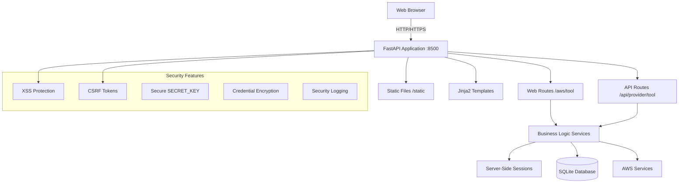

# CloudOpsTools

**A Multi-Cloud Script Execution Framework**

## What Is CloudOpsTools?

CloudOpsTools is a **unified framework for executing arbitrary scripts and workflows** across AWS, Azure, and GCP cloud environments. Think of it as your **multi-cloud automation engine** - you define the scripts, we handle the execution across accounts, regions, and providers.

### 🎯 Key Concept

The **Linux QC Patching workflows** (Prep/Post) and **SFT Fixer** included in this repository are **example implementations** that demonstrate the framework's capabilities. They showcase how to:

- Execute scripts across multiple AWS accounts and regions simultaneously
- Validate system state before and after changes
- Collect and aggregate results from distributed cloud resources
- Integrate with external systems (like ServiceNow)

**Your use case might be different** - and that's exactly what CloudOpsTools is designed for. Whether you're:
- Running compliance audits across your cloud estate
- Deploying configuration changes to hundreds of instances
- Collecting inventory data from multiple cloud providers
- Executing custom remediation scripts
- Orchestrating complex multi-step operations

CloudOpsTools provides the infrastructure to execute your scripts reliably and at scale.

## Overview

CloudOpsTools is a unified multi-cloud operations platform built with FastAPI, designed to standardize script execution and operations across AWS, Azure, GCP, and ServiceNow. The application serves both API endpoints and web interface from a single FastAPI process on port 8500.

## Current Status

- **Multi-Cloud Script Execution Framework**: ✅ Core engine for executing arbitrary scripts across cloud providers
- **AWS Implementation**: ✅ Full AWS support with multi-account/region script execution via SSM
- **Example Workflows**: ✅ Linux QC Patching (Prep/Post), SFT Fixer as reference implementations
- **Security Features**: ✅ Phase 1 security with XSS, CSRF, encryption, and feature flag controls
- **Session Management**: ✅ Server-side session storage with encryption support
- **Credential Management**: ✅ Secure AWS credential validation and caching (COM/GOV clouds)
- **Web Interface**: ✅ Bootstrap 5 UI with HTMX for dynamic workflow execution
- **Additional Providers**: 📝 Planned (Azure, GCP script execution engines)

## Architecture

The platform uses a unified FastAPI application with modular provider-based architecture:



### Key Design Principles

1. **Unified Architecture**: Single FastAPI process serves both API and web interface
2. **Provider Discovery**: Dynamic registration of provider routers from `/backend/providers/`
3. **Security by Design**: Feature-flagged security controls (XSS, CSRF, encryption)
4. **Session Management**: Server-side session storage with optional encryption
5. **Tool Modularity**: Self-contained provider tools with api/, services/, schemas/ structure
6. **Backward Compatibility**: URL redirects maintain existing integrations

## Project Structure

```bash
PCM-Ops_Tools/                 (repository root)
├── backend/                    (FastAPI application - main entry point)
│   ├── main.py                 (FastAPI app with provider discovery)
│   ├── core/                   (configuration, security, logging)
│   │   ├── config.py           (Settings with feature flags)
│   │   ├── security.py         (XSS, CSRF, encryption)
│   │   ├── feature_flags.py    (Feature flag management)
│   │   └── utils/              (encryption, session store)
│   ├── providers/              (modular tools by provider)
│   │   └── aws/
│   │       ├── common/         (shared AWS utilities)
│   │       └── script_runner/  (AWS Script Runner backend service)
│   ├── web/                    (web UI routes)
│   │   ├── home.py             (main dashboard)
│   │   └── aws/                (AWS tool web interfaces)
│   ├── api/                    (core API endpoints)
│   ├── db/                     (SQLAlchemy models and database)
│   ├── templates/              (Jinja2 templates for web UI)
│   └── static/                 (CSS, JS, images)
├── frontend/                   (new frontend development)
├── data/                       (SQLite database and runtime data)
├── logs/                       (application and security logs)
├── archive/                    (deprecated Flask frontend)
└── docs/                       (project documentation)
```

## Quick Start

### Prerequisites

- Python 3.11+
- Poetry (for dependency management)

### Installation

```bash
# Clone the repository
git clone <repository-url>
cd PCM-Ops_Tools

# Initial setup (installs Poetry if needed)
./setup.sh

# Start the application
./start.sh
```

The application will be available at: http://localhost:8500

### Development Mode

```bash
# Start with development database and AWS mocking
./start.sh --dev

# Start with debug logging
./start.sh --debug
```

## Features

### Framework Capabilities ✅

#### **Multi-Cloud Script Execution Engine**
- **AWS Script Runner**: Execute arbitrary scripts across multiple AWS accounts and regions via SSM
- **Multi-Account Support**: Discover and target instances across entire AWS Organizations
- **Region Flexibility**: Execute scripts in specific regions or across all available regions
- **Async Operations**: Non-blocking execution using `aiobotocore` for high performance and scalability
- **Result Aggregation**: Collect and consolidate execution results from distributed resources
- **State Tracking**: Monitor execution status, retry failed executions, and maintain audit trails

#### **Example Workflow Implementations** (Templates for Your Use Cases)
- **Linux QC Patching Prep**: Pre-patching validation and preparation workflow
- **Linux QC Patching Post**: Post-patching validation and reporting workflow
- **SFT Fixer**: ServiceNow field validation and correction workflow

These are **reference implementations** showing how to build your own workflows using the framework.

#### **Security Features** ✅
- **XSS Protection**: Input validation, security headers, content security policy
- **CSRF Protection**: Token-based protection for state-changing operations
- **Secure SECRET_KEY**: Auto-generated cryptographically secure keys
- **Credential Encryption**: Encrypted session storage for sensitive data
- **Security Logging**: Dedicated security event logging with structured format
- **Feature Flags**: Safe rollout/rollback controls for all security features

#### **Core Platform** ✅
- **Unified FastAPI Application**: Single process serving APIs and web UI
- **Dynamic Provider Discovery**: Automatic registration of provider tools
- **Session Management**: Server-side sessions with 30-minute timeout
- **Credential Management**: Secure AWS credential validation for COM/GOV clouds (with Azure/GCP support planned)
- **Database**: SQLite with SQLAlchemy 2.0 models for execution tracking and state management
- **Web Interface**: Bootstrap 5 UI with HTMX for dynamic updates

### Planned Features 📝

- **Azure Script Execution Engine**: Execute scripts across Azure subscriptions and resource groups
- **GCP Script Execution Engine**: Execute scripts across GCP projects and regions
- **ServiceNow Integration**: Enhanced ServiceNow automation and change management
- **Multi-Cloud Dashboards**: Unified execution monitoring across cloud providers
- **Advanced Reporting**: Cross-cloud execution analytics and cost reporting

## Building Your Own Workflows

CloudOpsTools is designed to be **extended with your own workflows**. The included patching workflows serve as templates showing the framework's capabilities.

### How to Create a Custom Workflow

1. **Define Your Script**: Write the shell/Python/PowerShell script you want to execute
2. **Create a Workflow Module**: Follow the pattern in `backend/web/workflows/`
3. **Configure Targeting**: Specify which accounts, regions, and instance criteria to target
4. **Execute**: Use the Script Runner backend to execute across your cloud infrastructure
5. **Collect Results**: Aggregate and analyze execution results from the database

### Example Use Cases

- **Security Compliance Audits**: Run security assessment scripts across all instances
- **Configuration Drift Detection**: Compare actual vs. expected configurations
- **Log Collection**: Gather specific logs from distributed systems
- **Performance Tuning**: Execute optimization scripts based on metrics
- **Disaster Recovery Testing**: Validate backup and recovery procedures
- **Custom Automation**: Any repeatable task that needs to run at scale

### Workflow Architecture

Each workflow consists of:
- **Web UI** (`backend/web/workflows/your_workflow.py`): User interface for configuration
- **Script Definition**: The actual script(s) to execute on target instances
- **Execution Logic**: Uses Script Runner service to execute across cloud resources
- **Result Processing**: Custom logic to interpret and display execution results

See the existing workflows in `backend/web/workflows/` as templates for building your own.

## Configuration

### Environment Variables

Copy `.env.example` to `.env` and configure:

```bash
# Core settings
SECRET_KEY=your-secure-secret-key
DATABASE_URL=sqlite:///./data/pcm_ops_tools.db
DEV_MODE=false

# AWS Credentials (optional - can use IAM roles)
AWS_ACCESS_KEY_ID_COM=your-commercial-access-key
AWS_SECRET_ACCESS_KEY_COM=your-commercial-secret-key
AWS_ACCESS_KEY_ID_GOV=your-govcloud-access-key
AWS_SECRET_ACCESS_KEY_GOV=your-govcloud-secret-key

# Security Feature Flags (Phase 1)
FEATURE_FLAG_NEW_SECRET_KEY_HANDLING=enabled
FEATURE_FLAG_XSS_PROTECTION_ENABLED=enabled
FEATURE_FLAG_CSRF_TOKENS_ENABLED=enabled
FEATURE_FLAG_SECURE_CREDENTIAL_STORAGE=enabled
FEATURE_FLAG_STRUCTURED_LOGGING=enabled
```

### Access Points

- **Web Interface**: http://localhost:8500
- **API Documentation**: http://localhost:8500/docs
- **Health Check**: http://localhost:8500/api/health

### AWS Tools Access

- **Linux QC Patching Prep**: http://localhost:8500/aws/linux-qc-patching-prep
- **Linux QC Patching Post**: http://localhost:8500/aws/linux-qc-patching-post
- **SFT Fixer**: http://localhost:8500/aws/sft-fixer

## Development

### Code Quality

```bash
# Format code
poetry run black backend/

# Sort imports
poetry run isort backend/

# Lint code
poetry run ruff check backend/

# Type checking
poetry run mypy backend/

# Run tests
poetry run pytest -q
```

### Database Operations

```bash
# Initialize database
poetry run python backend/db/init_db.py

# Development database
DATABASE_URL="sqlite:///./data/pcm_ops_tools_dev.db" poetry run python backend/db/init_db.py
```

## Contributing

- **Developer Workflow**: See `CLAUDE.md` for the complete development workflow protocol
- **Project Structure**: See `AGENTS.md` for detailed project structure and patterns
- **Quality Standards**: Run `poetry run black backend/ && poetry run ruff check backend/` before commits
- **Testing**: All new features require comprehensive test coverage

## License

[Add license information]
